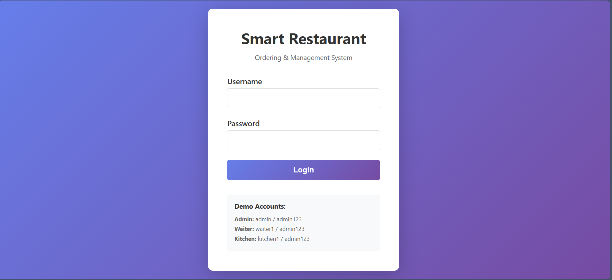
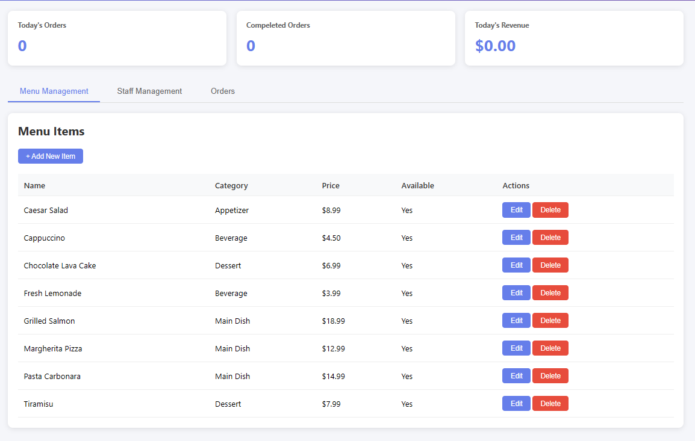
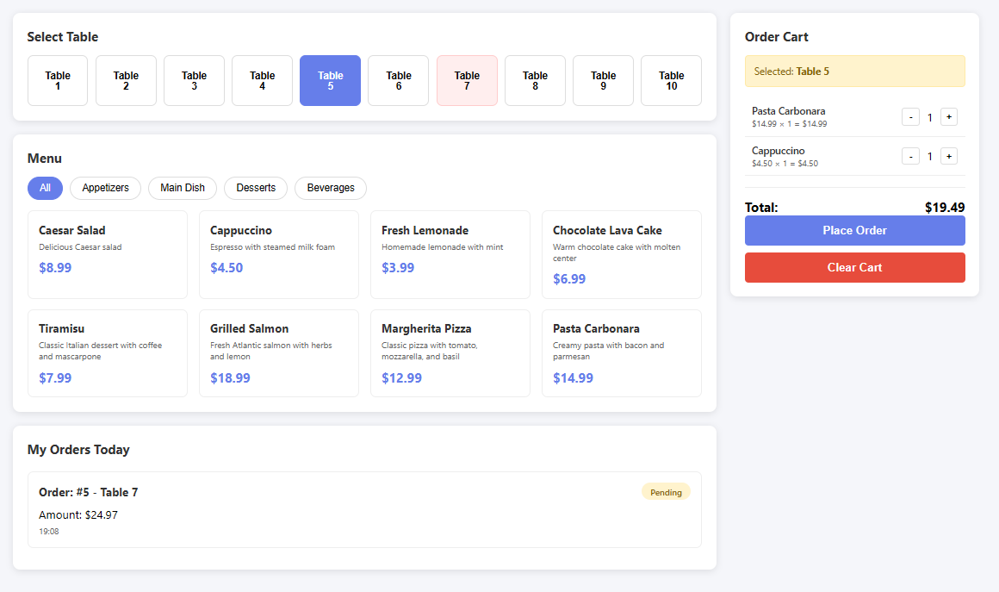
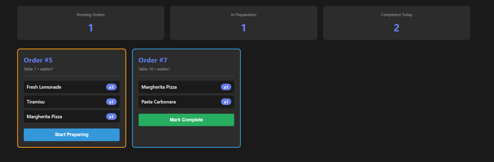

# 🍽️ Smart Restaurant Ordering & Management System

A web-based application that digitalizes restaurant operations by connecting waiters, kitchen staff, and management through real-time order processing.

## 📋 Table of Contents
- [What is This?](#what-is-this)
- [Why This System?](#why-this-system)
- [Features](#features)
- [Technologies Used](#technologies-used)
- [Installation](#installation)
- [Usage](#usage)
- [Screenshots](#screenshots)
- [Database Schema](#database-schema)
- [Security](#security)
- [Future Improvements](#future-improvements)
- [License](#license)

## What is This?

This is a restaurant management system that replaces paper orders with a digital platform. It has three different interfaces:

- **Admin Dashboard** - Manage menu items and staff accounts
- **Waiter Interface** - Take orders from tables using tablets
- **Kitchen Display** - See and update order status in real-time

Orders go from waiter → kitchen instantly. No more running back and forth!

## Why This System?

Traditional restaurants face these problems:

- ❌ Poor communication between staff
- ❌ Manual paper orders cause errors
- ❌ No way to track order status
- ❌ Wasted time walking between kitchen and tables

This system solves all of these by making everything digital and instant.

## Features

### Admin Dashboard
- ✅ Add, edit, and delete menu items
- ✅ Manage staff accounts (waiters and kitchen staff)
- ✅ View all orders and daily statistics
- ✅ Track revenue and completed orders

### Waiter Interface
- ✅ Select table and browse menu by category
- ✅ Add items to cart with quantities
- ✅ Place orders that go straight to kitchen
- ✅ See order status updates (pending → preparing → completed)
- ✅ View all orders for the day

### Kitchen Display
- ✅ See all incoming orders in real-time
- ✅ Mark orders as "preparing" or "completed"
- ✅ Shows elapsed time for each order
- ✅ Color-coded by status (pending = orange, preparing = blue)

## Technologies Used

**Frontend:**
- HTML5
- CSS3
- JavaScript (ES6+)

**Backend:**
- PHP 7.4+
- MySQL 8.0+

**Development Environment:**
- XAMPP (Apache + MySQL)

**Architecture:**
- Three-tier client-server model
  - Presentation Layer (HTML/CSS/JS)
  - Application Layer (PHP)
  - Database Layer (MySQL)

## Installation

### Prerequisites
- XAMPP or similar (Apache + MySQL + PHP)
- Web browser

### Steps

1. **Clone the repository**
```bash
git clone https://github.com/yourusername/smart-restaurant-system.git
cd smart-restaurant-system
```

2. **Import the database**
   - Open phpMyAdmin (http://localhost/phpmyadmin)
   - Create a new database called `restaurant_system`
   - Import `database.sql` file

3. **Configure database connection**
   - Open `config.php`
   - Update these values if needed:
```php
   define('DB_HOST', 'localhost');
   define('DB_USER', 'root');
   define('DB_PASS', '');
   define('DB_NAME', 'restaurant_system');
```

4. **Start Apache and MySQL**
   - Open XAMPP Control Panel
   - Start Apache and MySQL services

5. **Access the application**
   - Open browser and go to: `http://localhost/smart-restaurant-system/login.php`

## Usage

### Login Credentials

**Admin:**
- Username: `admin`
- Password: `admin123`

**Waiter:**
- Username: `waiter1`
- Password: `admin123`

**Kitchen Staff:**
- Username: `kitchen1`
- Password: `admin123`

### Typical Workflow

1. **Admin** adds menu items and creates staff accounts
2. **Waiter** logs in, selects a table, adds items to cart, and places order
3. **Kitchen** sees the order appear, marks it as "preparing", then "completed"
4. **Waiter** sees the status update and delivers the food

## Screenshots

### Login Page


### Admin Dashboard


### Waiter Interface


### Kitchen Display


## Database Schema

The system uses 5 main tables:

- **users** - Staff accounts (admin, waiter, kitchen)
- **menu_items** - Restaurant menu with prices and categories
- **tables** - Restaurant table numbers and status
- **orders** - Customer orders with total and status
- **order_items** - Individual items in each order

**Relationships:**
- One order has many order items
- One order belongs to one waiter
- One order belongs to one table

## Security

✅ **Password Hashing** - bcrypt algorithm

✅ **SQL Injection Prevention** - Prepared statements

✅ **XSS Prevention** - htmlspecialchars() on all output

✅ **CSRF Protection** - Token validation on forms

✅ **Session Management** - Role-based access control

✅ **Input Validation** - Server-side checks

## Future Improvements

- 🔮 WebSocket integration for true real-time updates
- 🔮 Order modification after placement
- 🔮 Payment processing and bill generation
- 🔮 Customer self-ordering via QR codes

## Project Structure
```
smart-restaurant-system/
├── config.php              # Database connection & session management
├── login.php               # Login page for all users
├── logout.php              # Logout handler
├── admin_dashboard.php     # Admin interface
├── waiter_interface.php    # Waiter interface
├── kitchen_display.php     # Kitchen display system
├── database.sql            # Database schema and sample data
├── styles/                 # CSS files
│   ├── admin_dashboard.css
│   ├── waiter_interface.css
│   └── kitchen_display.css
└── scripts/                # JavaScript files
    ├── dashboard_tabs.js
    └── waiter_interface.js
```

## Credits

**Developer:** Rasyar Safin Mustafa

**Course:** Advanced Web Development

**Supervisor:** Dr. Safar Maghdid Asaad

**Institution:** Koya University

**Date:** December 2025

## License

This project is created for educational purposes as part of the Advanced Web Development course.

---

**⭐ If you found this project helpful, please star the repository!**

For questions or issues, please open an issue on GitHub.
